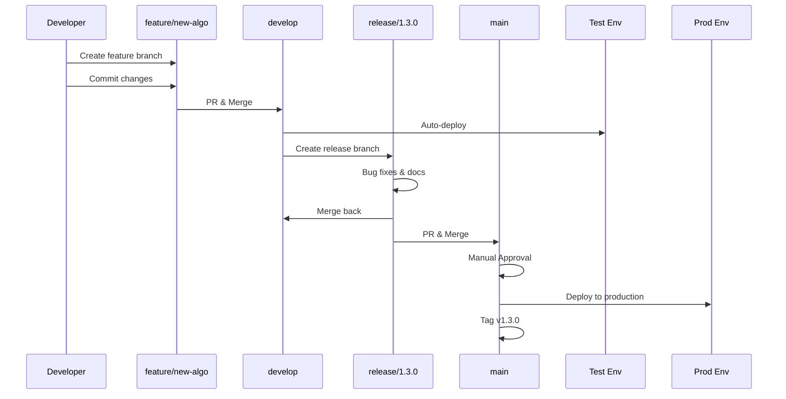
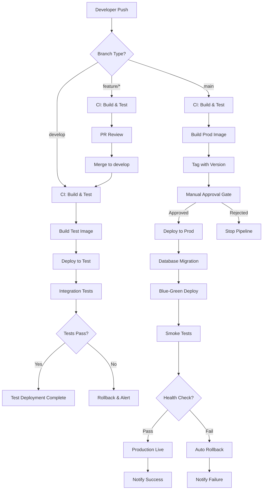

# CI/CD Pipeline Plan for HL7 Patient Matching Demo

**Version:** 1.0  
**Date:** June 23, 2026  
**Purpose:** Demonstrate GitFlow + GitOps for Test → Production deployment

---

## Table of Contents

1. [Overview](#overview)
2. [GitFlow Branching Strategy](#gitflow-branching-strategy)
3. [Environment Architecture](#environment-architecture)
4. [CI/CD Pipeline Workflow](#cicd-pipeline-workflow)
5. [GitHub Actions Workflows](#github-actions-workflows)
6. [GitOps Deployment Manifests](#gitops-deployment-manifests)
7. [Database Migration Strategy](#database-migration-strategy)
8. [Monitoring & Health Checks](#monitoring--health-checks)
9. [Rollback Procedures](#rollback-procedures)
10. [Implementation Checklist](#implementation-checklist)

---

## Overview

This CI/CD pipeline demonstrates production-grade practices for deploying the HL7 Patient Matching application across test and production environments using:

- **GitFlow**: Structured branching model for organized development
- **GitOps**: Git as the single source of truth for infrastructure
- **GitHub Actions**: Automated CI/CD orchestration
- **Podman**: Container runtime for both environments
- **Manual Approval Gates**: Human validation before production changes

### Key Principles

✅ **Automation First**: Automated testing and deployment to test environment  
✅ **Safety Gates**: Manual approval required for production  
✅ **Traceability**: Every deployment linked to Git commit  
✅ **Rollback Ready**: Quick rollback capability for failed deployments  
✅ **Environment Parity**: Test mirrors production configuration  

---

## GitFlow Branching Strategy

### Branch Structure

```
main (production)
  ├── hotfix/* (emergency fixes)
  └── release/* (release candidates)
       └── develop (integration)
            └── feature/* (new features)
```

### Branch Policies

#### **`main`** - Production Branch
- **Purpose**: Production-ready code only
- **Protection**: 
  - Requires PR approval (2 reviewers)
  - Status checks must pass
  - No direct commits
- **Deployment**: Auto-deploys to **prod** after manual approval
- **Tagging**: Semantic versioning (v1.2.0, v1.3.0)

#### **`develop`** - Integration Branch
- **Purpose**: Latest development changes
- **Protection**:
  - Requires PR approval (1 reviewer)
  - Status checks must pass
- **Deployment**: Auto-deploys to **test** on merge
- **Testing**: Integration tests run automatically

#### **`feature/*`** - Feature Branches
- **Naming**: `feature/description` (e.g., `feature/fhir-support`)
- **Created from**: `develop`
- **Merged to**: `develop` via PR
- **Lifecycle**: Deleted after merge

#### **`release/*`** - Release Branches
- **Naming**: `release/X.Y.0` (e.g., `release/1.3.0`)
- **Created from**: `develop`
- **Purpose**: Release preparation, bug fixes, documentation
- **Merged to**: Both `main` and `develop`

#### **`hotfix/*`** - Hotfix Branches
- **Naming**: `hotfix/description` (e.g., `hotfix/parser-crash`)
- **Created from**: `main`
- **Purpose**: Critical production fixes
- **Merged to**: Both `main` and `develop`

### Workflow Diagram



---

## Environment Architecture

### Test Environment

```yaml
Environment Name: test
Purpose: Integration testing, QA validation, demo
Auto-Deploy: Yes (on develop branch merge)

Infrastructure:
  Podman Network: hl7-test-network
  
  Containers:
    - Name: hl7-app-test
      Image: ghcr.io/your-org/hl7-patient-matching:test-latest
      Port: 3001
      
    - Name: hl7-postgres-test
      Image: postgres:15-alpine
      Port: 5433
      Database: hl7_matching_test
      
  Volumes:
    - hl7-test-db-data:/var/lib/postgresql/data
    - ./test-data:/app/data

Configuration:
  NODE_ENV: test
  DB_HOST: hl7-postgres-test
  DB_NAME: hl7_matching_test
  LOG_LEVEL: debug
```

### Production Environment

```yaml
Environment Name: prod
Purpose: Production workloads
Auto-Deploy: No (requires manual approval)

Infrastructure:
  Podman Network: hl7-prod-network
  
  Containers:
    - Name: hl7-app-prod
      Image: ghcr.io/your-org/hl7-patient-matching:v1.2.0
      Port: 3000
      
    - Name: hl7-postgres-prod
      Image: postgres:15-alpine
      Port: 5432
      Database: hl7_matching_prod
      Backup: Daily automated backups
      
  Volumes:
    - hl7-prod-db-data:/var/lib/postgresql/data
    - ./prod-data:/app/data

Configuration:
  NODE_ENV: production
  DB_HOST: hl7-postgres-prod
  DB_NAME: hl7_matching_prod
  LOG_LEVEL: info
  ENABLE_ALERTS: true
```

---

## CI/CD Pipeline Workflow

### Complete Pipeline Flow



### Pipeline Stages

#### **Stage 1: Continuous Integration (All Branches)**
- Code quality checks (ESLint, Prettier)
- Unit tests with coverage
- Build container image
- Vulnerability scanning (Trivy)
- Push to container registry

#### **Stage 2: Deploy to Test (develop only)**
- Pull latest image
- Database backup
- Run migrations
- Deploy containers
- Integration tests
- Health checks

#### **Stage 3: Manual Approval (main only)**
- Automated pre-checks
- Human approval (2 reviewers)
- Deployment checklist validation
- 7-day timeout

#### **Stage 4: Deploy to Production (after approval)**
- Database backup
- Blue-green deployment
- Smoke tests
- Traffic switch
- Monitoring period
- Cleanup old version

---

## GitHub Actions Workflows

### Required Secrets

Configure these in GitHub Settings → Secrets:

```yaml
# Container Registry
GITHUB_TOKEN: (automatic)

# Test Environment
TEST_HOST: test-server.example.com
TEST_USER: deploy
TEST_SSH_KEY: <private-key>
TEST_DB_PASSWORD: <password>

# Production Environment
PROD_HOST: prod-server.example.com
PROD_USER: deploy
PROD_SSH_KEY: <private-key>
PROD_DB_PASSWORD: <password>

# Notifications
SLACK_WEBHOOK: https://hooks.slack.com/services/...
```

### Workflow Files to Create

1. **`.github/workflows/ci.yml`** - Continuous Integration
   - Runs on all branches
   - Linting, testing, building
   - Container image creation

2. **`.github/workflows/deploy-test.yml`** - Test Deployment
   - Triggers on develop branch
   - Automated deployment
   - Integration testing

3. **`.github/workflows/deploy-prod.yml`** - Production Deployment
   - Triggers on main branch
   - Manual approval required
   - Blue-green deployment

4. **`.github/workflows/rollback.yml`** - Manual Rollback
   - Manual trigger only
   - Environment selection
   - Version selection

See the detailed workflow implementations in the appendix.

---

## GitOps Deployment Manifests

### Directory Structure

```
gitops/
├── base/
│   └── podman-compose.base.yml
├── overlays/
│   ├── test/
│   │   ├── podman-compose.test.yml
│   │   └── config.env
│   └── prod/
│       ├── podman-compose.prod.yml
│       └── config.env
└── README.md
```

### Test Environment Compose

**File**: `gitops/overlays/test/podman-compose.test.yml`

```yaml
version: '3.8'

services:
  postgres:
    image: postgres:15-alpine
    container_name: hl7-postgres-test
    environment:
      POSTGRES_DB: hl7_matching_test
      POSTGRES_USER: postgres
      POSTGRES_PASSWORD: ${TEST_DB_PASSWORD}
    volumes:
      - hl7-test-db-data:/var/lib/postgresql/data
      - ../../database/init.sql:/docker-entrypoint-initdb.d/init.sql:ro
    ports:
      - "5433:5432"
    networks:
      - hl7-test-network

  app:
    image: ghcr.io/your-org/hl7-patient-matching:test-latest
    container_name: hl7-app-test
    env_file:
      - config.env
    ports:
      - "3001:3000"
    depends_on:
      - postgres
    networks:
      - hl7-test-network

volumes:
  hl7-test-db-data:

networks:
  hl7-test-network:
```

### Production Environment Compose

**File**: `gitops/overlays/prod/podman-compose.prod.yml`

```yaml
version: '3.8'

services:
  postgres:
    image: postgres:15-alpine
    container_name: hl7-postgres-prod
    environment:
      POSTGRES_DB: hl7_matching_prod
      POSTGRES_USER: postgres
      POSTGRES_PASSWORD: ${PROD_DB_PASSWORD}
    volumes:
      - hl7-prod-db-data:/var/lib/postgresql/data
      - ../../database/init.sql:/docker-entrypoint-initdb.d/init.sql:ro
      - ./backups:/backups:rw
    ports:
      - "5432:5432"
    networks:
      - hl7-prod-network
    restart: always

  app:
    image: ghcr.io/your-org/hl7-patient-matching:${VERSION}
    container_name: hl7-app-prod
    env_file:
      - config.env
    ports:
      - "3000:3000"
    depends_on:
      - postgres
    networks:
      - hl7-prod-network
    restart: always

volumes:
  hl7-prod-db-data:

networks:
  hl7-prod-network:
```

---

## Database Migration Strategy

### Migration File Structure

```
database/
├── init.sql                    # Initial schema
├── migrations/
│   ├── v1.2.0.sql
│   ├── v1.3.0.sql
│   └── rollback/
│       ├── v1.2.0-rollback.sql
│       └── v1.3.0-rollback.sql
└── seeds/
    ├── test-data.sql
    └── prod-data.sql
```

### Migration Script Template

```sql
-- Migration: v1.3.0
-- Description: Add FHIR support
-- Date: 2026-06-23

BEGIN;

-- Version tracking
CREATE TABLE IF NOT EXISTS schema_migrations (
    version VARCHAR(20) PRIMARY KEY,
    applied_at TIMESTAMP DEFAULT NOW(),
    description TEXT
);

-- Check if already applied
DO $$
BEGIN
    IF EXISTS (SELECT 1 FROM schema_migrations WHERE version = 'v1.3.0') THEN
        RAISE NOTICE 'Migration v1.3.0 already applied';
        ROLLBACK;
        RETURN;
    END IF;
END $$;

-- Your migration changes here
ALTER TABLE patients ADD COLUMN IF NOT EXISTS fhir_id VARCHAR(100);

-- Record migration
INSERT INTO schema_migrations (version, description) 
VALUES ('v1.3.0', 'Add FHIR support');

COMMIT;
```

### Migration Execution

```bash
#!/bin/bash
# scripts/migrate.sh

ENVIRONMENT=${1:-test}
VERSION=${2:-latest}

# Backup before migration
podman exec hl7-postgres-$ENVIRONMENT pg_dump -U postgres \
    hl7_matching_$ENVIRONMENT > backup-pre-migration.sql

# Run migration
podman exec -i hl7-postgres-$ENVIRONMENT psql -U postgres \
    -d hl7_matching_$ENVIRONMENT < database/migrations/$VERSION.sql

# Verify
podman exec hl7-postgres-$ENVIRONMENT psql -U postgres \
    -d hl7_matching_$ENVIRONMENT -c \
    "SELECT * FROM schema_migrations ORDER BY applied_at DESC LIMIT 5;"
```

---

## Monitoring & Health Checks

### Health Check Endpoints

Add to [`backend/server.js`](backend/server.js):

```javascript
// Health check endpoint
app.get('/api/health', async (req, res) => {
    try {
        // Check database
        const dbResult = await pool.query('SELECT NOW()');
        
        // Check application
        const stats = {
            status: 'healthy',
            timestamp: new Date().toISOString(),
            version: process.env.npm_package_version,
            environment: process.env.NODE_ENV,
            database: 'connected',
            uptime: process.uptime()
        };
        
        res.json(stats);
    } catch (error) {
        res.status(503).json({
            status: 'unhealthy',
            error: error.message
        });
    }
});

// Readiness check
app.get('/api/ready', async (req, res) => {
    try {
        await pool.query('SELECT 1');
        res.json({ ready: true });
    } catch (error) {
        res.status(503).json({ ready: false });
    }
});

// Liveness check
app.get('/api/alive', (req, res) => {
    res.json({ alive: true });
});
```

### Monitoring Metrics

Track these metrics for each environment:

- **Application Metrics**
  - Request rate (req/sec)
  - Response time (ms)
  - Error rate (%)
  - Active connections

- **Database Metrics**
  - Query execution time
  - Connection pool usage
  - Active queries
  - Database size

- **Business Metrics**
  - Patients processed/day
  - Matches found/day
  - Merge operations/day

---

## Rollback Procedures

### Automatic Rollback (Production)

Triggers automatically if:
- Health checks fail after deployment
- Error rate exceeds threshold
- Smoke tests fail

Process:
1. Stop new (green) container
2. Start old (blue) container
3. Restore database backup
4. Verify health
5. Alert team

### Manual Rollback

Use GitHub Actions workflow:

```bash
# Via GitHub UI
Actions → Manual Rollback → Run workflow
  Environment: production
  Version: v1.2.0

# Via GitHub CLI
gh workflow run rollback.yml \
  -f environment=production \
  -f version=v1.2.0
```

### Rollback Checklist

```markdown
- [ ] Identify version to rollback to
- [ ] Verify backup exists
- [ ] Stop current application
- [ ] Restore database backup
- [ ] Start previous version
- [ ] Run health checks
- [ ] Verify functionality
- [ ] Update status page
- [ ] Notify stakeholders
- [ ] Create incident report
```

---

## Implementation Checklist

### Phase 1: Repository Setup

- [ ] Create GitHub repository
- [ ] Set up branch protection rules
- [ ] Configure required reviewers
- [ ] Add repository secrets
- [ ] Create `.github/workflows/` directory

### Phase 2: GitOps Structure

- [ ] Create `gitops/` directory structure
- [ ] Write test environment compose file
- [ ] Write production environment compose file
- [ ] Create environment config files
- [ ] Document deployment process

### Phase 3: CI/CD Workflows

- [ ] Create `ci.yml` workflow
- [ ] Create `deploy-test.yml` workflow
- [ ] Create `deploy-prod.yml` workflow
- [ ] Create `rollback.yml` workflow
- [ ] Test workflows on feature branch

### Phase 4: Database Migrations

- [ ] Create `database/migrations/` directory
- [ ] Write migration script template
- [ ] Create rollback script template
- [ ] Write migration execution script
- [ ] Test migrations on test environment

### Phase 5: Monitoring

- [ ] Add health check endpoints
- [ ] Configure Slack notifications
- [ ] Set up monitoring dashboards
- [ ] Create alerting rules
- [ ] Document monitoring procedures

### Phase 6: Testing

- [ ] Test feature branch workflow
- [ ] Test develop branch auto-deploy
- [ ] Test main branch approval process
- [ ] Test rollback procedure
- [ ] Perform end-to-end test

### Phase 7: Documentation

- [ ] Update README with CI/CD info
- [ ] Create deployment runbook
- [ ] Document rollback procedures
- [ ] Create troubleshooting guide
- [ ] Train team on workflows

---

## Appendix: Complete Workflow Files

### A. CI Workflow (ci.yml)

See separate file: `.github/workflows/ci.yml`

Key features:
- Runs on all branches
- Linting and testing
- Container image build
- Vulnerability scanning
- Push to registry

### B. Test Deployment (deploy-test.yml)

See separate file: `.github/workflows/deploy-test.yml`

Key features:
- Triggers on develop merge
- Automated deployment
- Integration testing
- Slack notifications

### C. Production Deployment (deploy-prod.yml)

See separate file: `.github/workflows/deploy-prod.yml`

Key features:
- Triggers on main merge
- Manual approval gate
- Blue-green deployment
- Automatic rollback
- Comprehensive monitoring

### D. Manual Rollback (rollback.yml)

See separate file: `.github/workflows/rollback.yml`

Key features:
- Manual trigger only
- Environment selection
- Version selection
- Database restoration

---

## Summary

This CI/CD pipeline provides:

✅ **GitFlow**: Structured development workflow  
✅ **GitOps**: Infrastructure as code  
✅ **Automation**: Test environment auto-deploys  
✅ **Safety**: Production requires approval  
✅ **Reliability**: Automatic rollback on failure  
✅ **Traceability**: Every change tracked in Git  
✅ **Monitoring**: Health checks and alerts  
✅ **Documentation**: Complete runbooks  

### Next Steps

1. Review this plan with your team
2. Customize for your specific infrastructure
3. Implement phase by phase
4. Test thoroughly in test environment
5. Deploy to production with confidence

---

**Document Version**: 1.0  
**Last Updated**: June 23, 2026  
**Maintained By**: DevOps Team